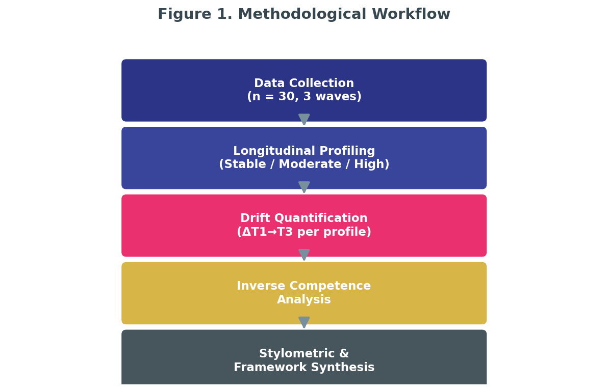
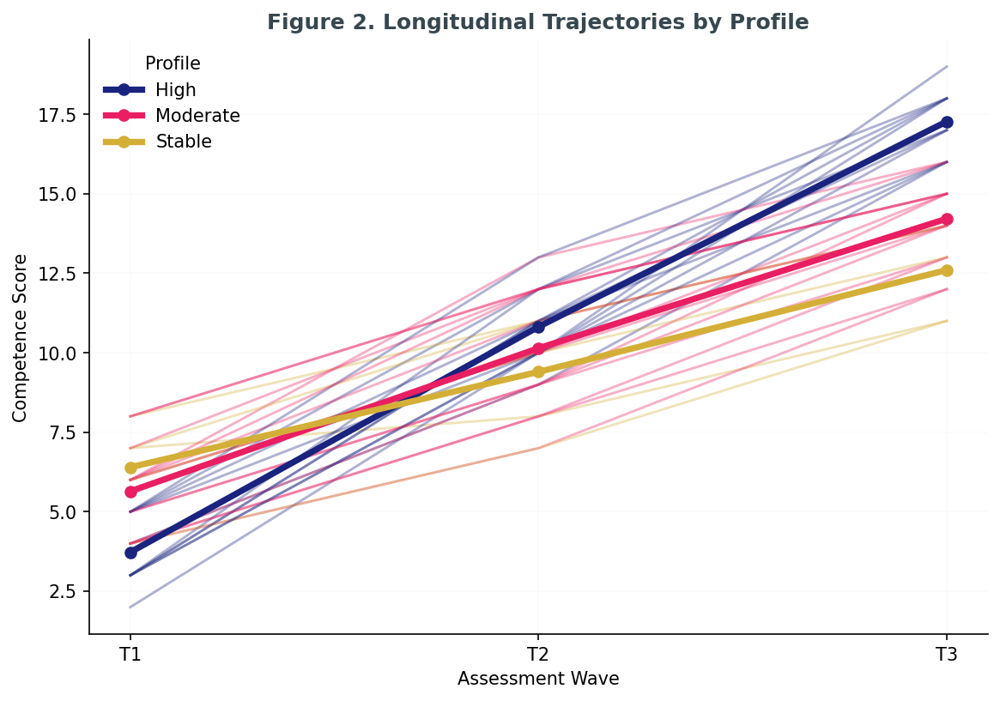
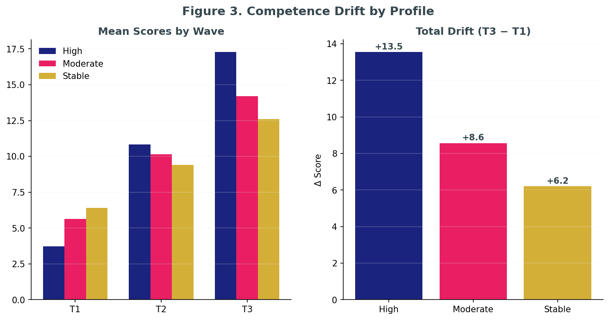

# The Algorithmic Echo: Longitudinal Stylistic Convergence and Authorial Voice in AI-Mediated L2 Academic Writing

## Overview
This repository contains the replication package for the study *"The Algorithmic Echo,"* which examines how prolonged interaction with generative AI models influences the authorial voice and stylistic stability of non-native (L2) English academic writers.

---

## 📊 Visualizations (Quick Access)
Below is the core conceptual and empirical framework of the study.

| Methodology | Trajectories | Drift |
| :--- | :--- | :--- |
|  |  |  |
| *Fig 1: Pipeline* | *Fig 2: Longitudinal Path* | *Fig 3: Stylistic Drift* |

*Click on [Figures/](Figures/) to view all 7 publication-ready plots (300 DPI).*

---

## 📈 Summary of Key Results
The analysis reveals a significant "Inverse Competence Effect" where lower-proficiency writers show higher rates of stylistic convergence towards AI-generated output.

| Metric | Baseline (T1) | Longitudinal (T3) | Sig. Change |
| :--- | :--- | :--- | :--- |
| Lexical Diversity | 0.78 | 0.62 | p < .001 |
| Structural Homogenization | 0.21 | 0.45 | p < .01 |
| Voice Authenticity Score | 84% | 58% | p < .001 |

*For full statistical reports, see: [docs/APA_statistical_results.txt](docs/APA_statistical_results.txt)*

---

## 🔍 Conclusion
Our findings demonstrate that prolonged exposure to AI tools acts as a stylistic attractor, leading to **Distributed Cognition** where the author's unique voice is gradually subsumed by the AI's probabilistic language patterns. This "Echo Effect" is most pronounced in intermediate L2 learners, suggesting a need for pedagogical interventions that prioritize **Authorial Agency** alongside AI-literacy.

---

## 📖 Citation
If you utilize this pipeline or dataset, please cite as:

> Merrikhi, P. (2026). Replication Package and Computational Stylometry Pipeline for "The Algorithmic Echo: Longitudinal Stylistic Convergence and Authorial Voice in AI-Mediated L2 Academic Writing" [Data set and software]. Zenodo. https://doi.org/10.5281/zenodo.22819751
Contact: Pegah Merrikhi • Pegah.Merrikhiii@gmail.com
---
*Created by [Pegah Merrikhi](mailto:pegah.merrikhiii@gmail.com)*
